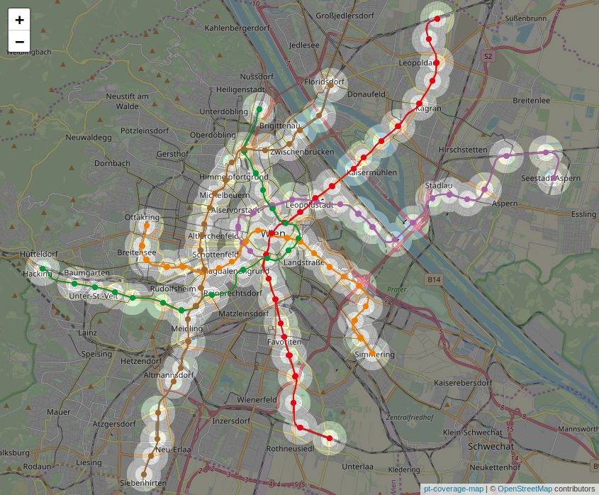

# Simple OSM Map
Create simple, interactive maps from data in OpenStreetMap format with a custom style

Example: 

## Installation
### As standalone project
```sh
npm install
cp -r example/ data/ # Modify the style.yaml in data/
npm start  # start built-in http server (of course, you can use Apache2 too)
```

Browse to http://localhost:8080

## Usage
### Alternate .osm file
BY default, simple-osm-map uses Overpass API for loading data. Alternatively, you could specify a file in OSM format as data soure:
* http://localhost:8080/?data=filename.osm

This would load `filename.osm` from the data/ directory.

The following script can help download data from Overpass API to a .osm file:
```sh
node get_data --help  # how to modify parameters
node get_data
```

### Alternate style file
Specify an alternate style file with the style parameter:
* http://localhost:8080/?style=foobar.yaml

This would load `foobar.yaml` from the data/ directory.

## Example style.yaml
```yaml
layers:
- query: way[highway]
  feature:
    title: Road ({{ tags.highway }})
    style:
      color: white
      width: 5

- query: |
    (
    nwr[natural=wood];
    nwr[landuse=forest];
    )
  feature:
    style:
      fillColor: #007f00
```

## Additional features
### Panes
```yaml
panes:
  casing:
    zIndex: 399
    opacity: 0.5
  highlight:
    zIndex: 401
```

Add additional panes. Set style options as sub-object, including 'zIndex'.

## Development
When developing, use the following command to automatically update the compiled JS file - with debugging information included:
```sh
npm run watch
```
